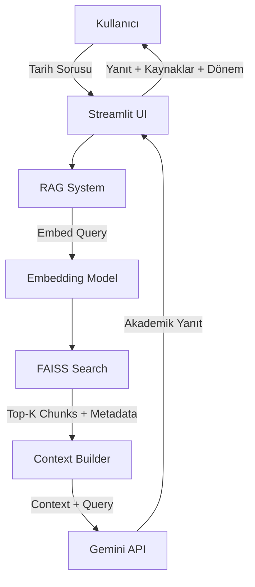

# 🏗️ Çözüm Mimarisi

Bu dokümanda Tarih Bilgi Rehberi Chatbot projesinin teknik mimarisi, kullanılan teknolojiler ve RAG pipeline detayları açıklanmaktadır.

## 📋 İçindekiler
1. [Genel Bakış](#genel-bakış)
2. [Teknoloji Stack](#teknoloji-stack)
3. [RAG Pipeline](#rag-pipeline)
4. [Sistem Mimarisi](#sistem-mimarisi)
5. [Veri Akışı](#veri-akışı)
6. [Performans ve Optimizasyon](#performans-ve-optimizasyon)

---

## 🎯 Genel Bakış

### Problemin Tanımı
Tarih öğrencileri, araştırmacılar ve tarih meraklılarının güvenilir, kaynaklı ve hızlı Türk Tarihi bilgisine erişim ihtiyacı bulunmaktadır. Geleneksel bilgi arama yöntemleri:
- Dağınık kaynaklarda arama yapmak zaman alıcı
- Bilgi doğruluğunu teyit etmek zor
- Kaynak referanslarına ulaşmak karmaşık
- Kronolojik bağlamı anlamak zorlaşabiliyor

### Çözümümüz
RAG (Retrieval Augmented Generation) tabanlı bir chatbot ile:
- ✅ 7/24 kesintisiz erişim
- ✅ Anında, kaynaklı yanıt verme
- ✅ Akademik kaynaklardan doğrulanmış bilgi
- ✅ Dönem ve kategori bazlı filtreleme
- ✅ Kronolojik bağlamı koruma
- ✅ TDK ve TTK gibi güvenilir kaynaklara dayalı

---

## 🛠️ Teknoloji Stack

### 1. Backend Framework
**LangChain v0.1.0**
- RAG pipeline orkestrasyon
- JSON doküman yükleme ve işleme
- Tarihsel metadata yönetimi

### 2. Large Language Model (LLM)
**Google Gemini 2.0 Flash**
- **Seçim Nedenleri:**
  - Ücretsiz API (günlük 1500 request)
  - Hızlı yanıt süresi (~1-2 saniye)
  - Türkçe dil desteği (Türk Tarihi için kritik)
  - 1M token context window
  - Akademik ton ve terminoloji desteği
  
- **Alternatifler:**
  - OpenAI GPT-4 (ücretli, daha güçlü)
  - Anthropic Claude (ücretli)
  - Open-source modeller (Llama, Mistral)

### 3. Embedding Model
**sentence-transformers/paraphrase-multilingual-MiniLM-L12-v2**
- **Özellikler:**
  - Çok dilli destek (Türkçe dahil)
  - 384 boyutlu vektörler
  - Hızlı inference (~50ms/doküman)
  - Hafif model (420MB)
  - Tarihsel terminolojiyi iyi yakalama
  
- **Performans:**
  - Cosine similarity ile yüksek doğruluk
  - Anlamsal benzerlik yakalama
  - CPU'da verimli çalışma

### 4. Vector Database
**FAISS (Facebook AI Similarity Search)**
- **Seçim Nedenleri:**
  - Yüksek hızlı similarity search
  - CPU optimizasyonu
  - Düşük memory footprint
  - Kolay entegrasyon
  
- **Index Tipi:** IndexFlatIP (Inner Product)
- **Metrik:** IP (Inner Product / Cosine Similarity)
- **Alternatifler:**
  - Pinecone (cloud-based, scalable)
  - Chroma (developer-friendly)
  - Weaviate (GraphQL API)

### 5. Web Framework
**Streamlit v1.29.0**
- **Avantajları:**
  - Python-only development
  - Hızlı prototipleme
  - Yerleşik UI komponenleri
  - Kolay deployment
  
- **Özellikler:**
  - Session management
  - Caching (@st.cache_resource)
  - Responsive design
  - Dönem bazlı filtreleme desteği

---

## 🔄 RAG Pipeline

### Pipeline Genel Yapısı

```
[JSON Veriler] → [Parse & Metadata] → [Chunking] → [Embedding] → [Vector DB]
                                                                        ↓
[Kullanıcı Sorusu] → [Query Embedding] → [Similarity Search] ← [FAISS]
                                                ↓
                                          [Top-K Chunks]
                                          (Dönem, Yıl, Kategori ile zenginleştirilmiş)
                                                ↓
                                    [Context + Query] → [LLM] → [Yanıt]
```

### 1. Veri Hazırlama (Data Preparation)

#### A. JSON Veri Yükleme
```python
Veri Yapısı:
{
  "id": "osmanli_001",
  "donem": "Osmanlı Devleti",
  "alt_donem": "Yükselme Dönemi",
  "kategori": {
    "ana": "Siyasi Olaylar",
    "alt": "Fetihler"
  },
  "konu": "İstanbul'un Fethi",
  "icerik": "İstanbul, 29 Mayıs 1453 tarihinde...",
  "yil": 1453,
  "anahtar_kelimeler": ["İstanbul", "Fatih Sultan Mehmed"],
  "etiketler": ["fetih", "askeri strateji"],
  "kaynak": "Türk Tarih Kurumu",
  "kaynak_turu": "Kitap",
  "referans_link": "https://www.ttk.gov.tr/..."
}
```

**Dönemler:**
- İslamiyet Öncesi Türk Tarihi
- İlk Türk-İslam Devletleri
- Anadolu Beylikleri Dönemi
- Osmanlı Devleti
- Millî Mücadele Dönemi
- Cumhuriyet Dönemi

#### B. Preprocessing
```python
Adımlar:
1. JSON parse ve validasyon
2. Metadata zenginleştirme (dönem, yıl, kategori)
3. İçerik birleştirme (konu + icerik + anahtar kelimeler)
4. Özel karakter temizleme (Türkçe karakterler korunur)
5. Fazla boşluk kaldırma
```

#### C. Text Chunking
```python
RecursiveCharacterTextSplitter:
- chunk_size: 512 karakter
- chunk_overlap: 50 karakter
- separators: ["\n\n", "\n", ".", "!", "?", ",", " "]

Neden bu parametreler?
- 512: Tarihsel olayları bütün tutmak için optimal
- 50: Kronolojik bağlamı korumak için overlap
- Separators: Olay akışının bütünlüğünü korur
```

**Chunk Stratejisi:**
```
Tarihsel Olay: "İstanbul'un Fethi (1453)..."
↓
Chunk 1: [Konu + İlk Paragraf + Metadata]
Chunk 2: [Devam + Sonuçlar + Metadata]
Her chunk dönem, yıl, kategori bilgisi taşır
```

### 2. Embedding Generation

```python
Model: paraphrase-multilingual-MiniLM-L12-v2
Input: Tarihsel metin chunk (512 karakter)
Output: 384-dimensional vector

Process:
1. Tokenization (Türkçe)
2. BERT encoding
3. Mean pooling
4. Normalization
5. Vector output (float32[384])
```

**Embedding Örneği:**
```python
Text: "Malazgirt Savaşı, 1071 yılında Büyük Selçuklu Sultanı Alparslan..."
↓
Vector: [0.34, -0.21, 0.67, ..., 0.15]  # 384 dimension
```

### 3. Vector Storage (FAISS)

```python
Index Type: IndexFlatIP
- Exact search (brute force)
- IP (Inner Product) metric (Kosinüs Benzerliği için)
- No quantization
- Memory: ~1.5KB per vector

Index Creation:
dimension = 384
index = faiss.IndexFlatIP(dimension)
# Vektörler L2 normalize edildi (data_processing.py'de)
index.add(embeddings)  # numpy array (n_chunks, 384)

Metadata Storage:
- Dönem bilgisi
- Yıl bilgisi
- Kategori (ana/alt)
- Kaynak referansı
- Etiketler
```

### 4. Retrieval Phase

#### A. Query Embedding
```python
User Query → Same Embedding Model → Query Vector (384-dim)

Örnek:
"Osmanlı Devleti'nin yükselme dönemi" → [0.23, -0.41, ...]
```
#### Algorithm: K-Nearest Neighbors (KNN)
Metric: IP (Inner Product / Cosine Similarity)

Search Process:
1. Compute score: score = dot(query_vec, doc_vec)
2. Sort by score (descending)
3. Return top-k results with metadata
4. The returned score *is* the Cosine Similarity (çünkü vektörler L2 normalize edildi)

Parameters:
- top_k: 5 (en alakalı 5 chunk)
- threshold: 0.3 (minimum similarity score)

Retrieved Data:
- Content (chunk metni)
- Dönem (Osmanlı Devleti)
- Yıl (1453)
- Kaynak (TTK)
- Similarity score (0.87)
```

### 5. Generation Phase

#### A. Context Preparation
```python
Retrieved Chunks (5) → Format with Metadata → Context Text

Format:
"""
Kaynak 1 (Osmanlı Devleti, 1453 - Türk Tarih Kurumu):
[chunk 1 content]

---

Kaynak 2 (Osmanlı Devleti, 1520 - TDK):
[chunk 2 content]

...
"""
```

#### B. Prompt Engineering (Tarih Asistanı için Özelleştirilmiş)
```python
Prompt Template:
"""
Sen Türk Tarihi konusunda uzmanlaşmış bir yapay zeka asistanısın.

BİLGİ BANKASI:
{context}
(Dönem, yıl ve kaynak bilgileri ile zenginleştirilmiş)

KULLANICI SORUSU:
{query}

YANIT KURALLARI:
1. Sadece bilgi bankasındaki bilgileri kullan
2. Akademik ama anlaşılır dil
3. Tarihsel olayları kronolojik sırada anlat
4. Tarihleri, isimleri, yerleri net belirt
5. Kaynak referanslarını belirt (TTK, TDK)
6. Kronolojik bağlamı koru
7. Emoji kullanma, ciddi ve akademik ol

YANIT:
"""
```

#### C. LLM Generation
```python
Model: Gemini 1.5 Flash
Temperature: 0.7 (tarihsel doğruluk için dengeli)
Max tokens: 1024
Top-p: 0.9

Process:
1. Prompt → Gemini API
2. Token generation (Türkçe akademik dil)
3. Response formatting
4. Kaynak referanslarını dahil etme
```

---

## 🏛️ Sistem Mimarisi

### Modüler Yapı

```
tarih-bilgi-rehberi-chatbot/
│
├── data/
│   ├── raw/                           # JSON veri dosyaları
│   │   ├── islamiyet_oncesi.json
│   │   ├── ilk_turk_islam_devletleri.json
│   │   ├── anadolu_beylikleri.json
│   │   ├── osmanli_devleti.json
│   │   ├── milli_mucadele.json
│   │   └── cumhuriyet.json
│   └── processed/                     # İşlenmiş veri (opsiyonel)
│
├── models/
│   ├── embeddings/                    # Embedding model cache
│   └── faiss_index/                   # FAISS index dosyaları
│       ├── index.faiss                # Vector index
│       └── metadata.json              # Tarihsel metadata
│
├── src/
│   ├── __init__.py                    # Package init
│   ├── data_processing.py             # JSON veri işleme
│   ├── retrieval.py                   # FAISS retrieval
│   ├── rag_system.py                  # RAG engine
│   └── utils.py                       # Yardımcı fonksiyonlar
│
├── app.py                             # Streamlit UI (Tarih temalı)
├── requirements.txt
├── .env                               # API keys
├── setup.py                           # Kurulum scripti
└── README.md                          # Proje dokümantasyonu
```

### Veri Akış Diyagramı



### Component İlişkileri

```
┌─────────────────────────────────────────────┐
│      Streamlit Frontend (Tarih Temalı)     │
│  (Session, Dönem Filtreleri, Timeline)      │
└──────────────────┬──────────────────────────┘
                   │
┌──────────────────▼──────────────────────────┐
│         RAG System Core (Tarih)             │
│  ┌────────────┐      ┌──────────────┐      │
│  │  Retriever │◄────►│  Generator   │      │
│  │  +Metadata │      │  +Tarih AI   │      │
│  └────────────┘      └──────────────┘      │
└──────────────────┬──────────────────────────┘
                   │
    ┌──────────────┼──────────────┐
    │              │              │
    ▼              ▼              ▼
┌────────┐  ┌──────────┐  ┌───────────┐
│ FAISS  │  │ Sentence │  │  Gemini   │
│ +Meta  │  │Transform │  │  (Türkçe) │
└────────┘  └──────────┘  └───────────┘
```

---

## ⚡ Performans ve Optimizasyon

### 1. Caching Stratejileri

#### Streamlit Cache
```python
@st.cache_resource
def load_rag_system():
    # RAG sistem bir kez yüklenir
    # Tüm kullanıcılar aynı instance'ı kullanır
    return RAGSystem()
```

#### Model Cache
```python
# Sentence Transformers otomatik cache
~/.cache/torch/sentence_transformers/
```

### 2. Performans Metrikleri

| İşlem | Süre | Optimizasyon |
|-------|------|--------------|
| Model yükleme | ~3s | Cache ile 0s |
| JSON parse | ~50ms/file | Batch processing |
| Doküman embedding | ~50ms/doc | Paralel işleme |
| Query embedding | ~30ms | - |
| FAISS search | ~5ms | Index optimizasyonu |
| LLM generation | ~2s | Streaming |
| **Toplam yanıt** | **~2-3s** | - |

### 3. Scalability

#### Horizontal Scaling
```
Mevcut: Single instance
↓
Önerilen: Multi-instance + Load Balancer
- Nginx / HAProxy
- Multiple Streamlit instances
- Shared FAISS index (Read-only)
- Dönem bazlı sharding (opsiyonel)
```

#### Vertical Scaling
```
RAM: 4GB → 8GB (daha fazla dönem verisi)
CPU: 2 core → 4 core (daha hızlı embedding)
```

### 4. Optimizasyon Önerileri

#### A. Embedding Optimization
- **GPU kullanımı**: CUDA desteği ile 10x hızlanma
- **Quantization**: Model boyutunu %75 azalt
- **Batch processing**: Birden fazla query paralel işle

#### B. FAISS Optimization
- **IVF Index**: 10K+ doküman için inverted file
- **Dönem bazlı indexler**: Her dönem için ayrı index
- **PQ (Product Quantization)**: Memory kullanımını azalt

#### C. LLM Optimization
- **Response streaming**: Kullanıcı deneyimi iyileştir
- **Prompt caching**: Tekrarlayan tarih promptları cache'le
- **Batch requests**: Birden fazla query tek API call

---

## 🔒 Güvenlik

### 1. API Key Yönetimi
```python
# Environment variables
GOOGLE_API_KEY in .env
Never commit .env to Git
Use secrets management in production
```

### 2. Rate Limiting
```python
# Gemini API limits
1500 requests/day (free tier)
15 requests/minute

# Application level
Max 10 queries/minute per user (önerilir)
```

### 3. Input Validation
```python
# Query validation
Max length: 500 characters
Sanitize special characters
Prevent prompt injection
Tarihsel içerik kontrolü
```

---

## 📊 Monitoring ve Logging

### Metrikler
- Response time
- Query success rate
- Dönem bazlı kullanım
- Error rate
- Kaynak referans doğruluğu
- API usage

### Logging
```python
# Log levels
INFO: Normal operations (query, retrieval)
WARNING: Performance issues
ERROR: System failures
DEBUG: Dönem/kategori filtreleme
```

---

## 🚀 Gelecek İyileştirmeler

1. **Multimodal Support**: Görsel ve PDF doküman analizi
2. **Conversation Memory**: Çoklu soru-cevap bağlamı
3. **Hybrid Search**: Keyword + Semantic search
4. **Fine-tuning**: Domain-specific model
5. **A/B Testing**: Prompt optimization
6. **Analytics Dashboard**: Kullanım istatistikleri

---

**Son Güncelleme**: Ekim 2025  
**Versiyon**: 1.0.0