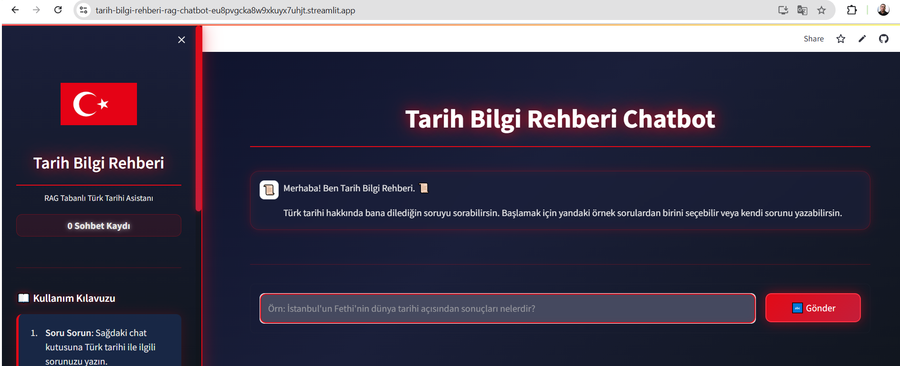
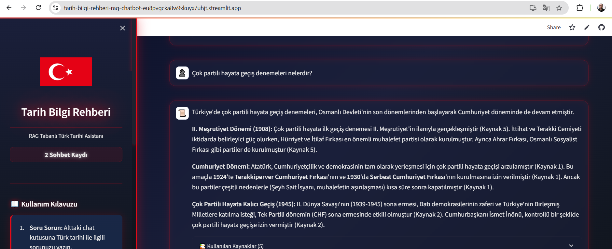
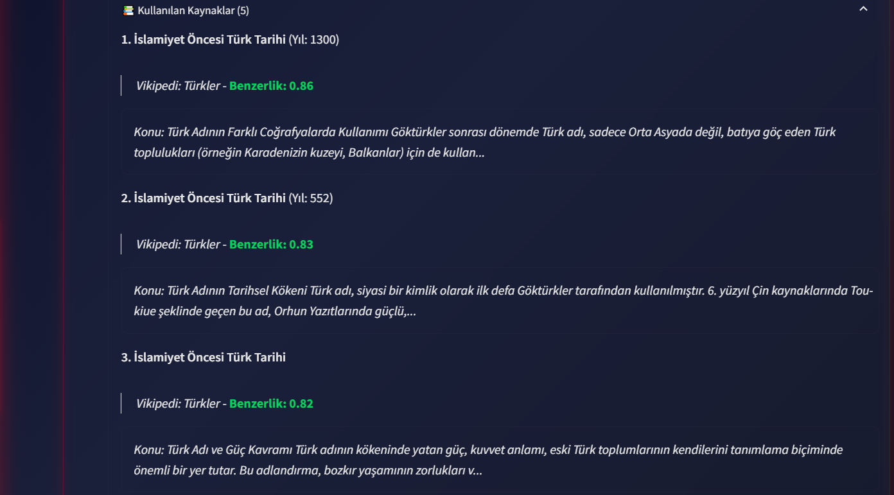
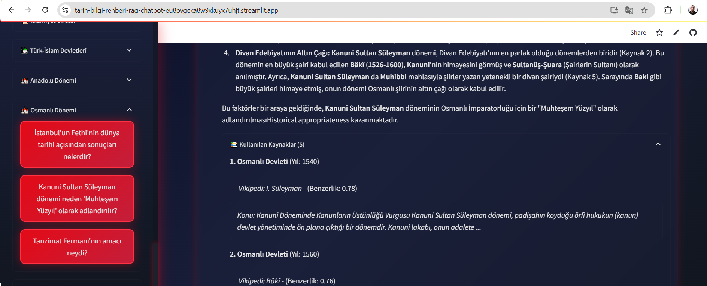
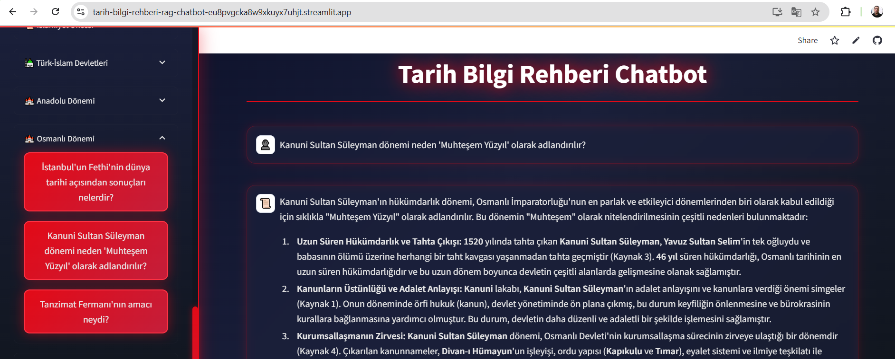
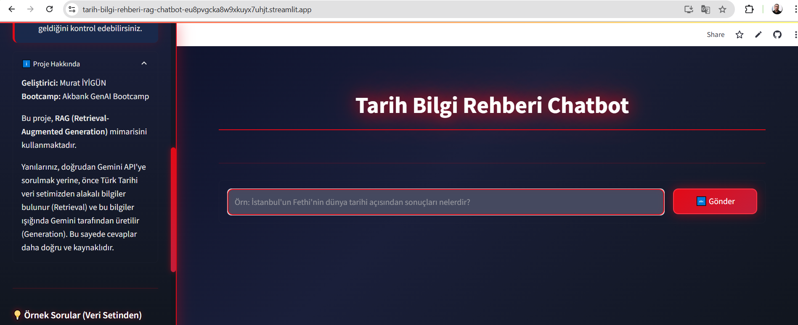

# 📚 Tarih Bilgi Rehberi Chatbot
### RAG Tabanlı Türk Tarihi Asistanı

---

## 🎯 Projenin Amacı

Bu proje, Türk tarihine dair kapsamlı ve güvenilir bilgilere 7/24 erişim sağlayan, **RAG (Retrieval Augmented Generation)** mimarisi ile güçlendirilmiş bir yapay zeka asistanı geliştirmeyi amaçlamaktadır.

### 👥 Hedef Kitle

- 🎓 Öğrenciler ve akademisyenler
- 📖 Tarih meraklıları
- 🔬 Araştırmacılar
- 📝 KPSS/YKS/TYT hazırlık yapanlar

### ✨ Temel Özellikler

- ⏳ İslamiyet öncesinden günümüze Türk tarihi
- 📅 Kronolojik ve tematik sorgulama
- 📚 Kaynak referansları ile doğrulanmış bilgiler
- 💬 Doğal dil ile soru-cevap

---

## 📊 Veri Seti Hakkında Bilgi

### 🔍 Veri Kaynağı ve Metodoloji

Projenin veri seti **tamamen açık kaynaklardan** oluşturulmuştur ve **telif ihlali riski taşımamaktadır**.

#### Kullanılan Açık Kaynaklar

| Kaynak Türü | Açıklama |
|------------|----------|
| **Vikipedi** | Temel tarihsel bilgilerin ve kronolojinin ana kaynağı (Tüm dönemler) |
| **Resmi Kurumlar** | Özellikle Millî Mücadele ve Cumhuriyet dönemleri (Atatürk Ansiklopedisi, TÜBİTAK Ansiklopedi, İnönü Vakfı) |
| **Akademik Dergiler** | DergiPark, ATAM Dergisi |
| **Diğer Açık Kaynaklar** | TDK, TTK, Wikisource, Anadolu Ajansı |

### 📂 Veri Oluşturma Süreci

1. **Kapsam Belirleme:** Türk tarihi kronolojik olarak 6 ana döneme ayrıldı
2. **Alt Kategorizasyon:** Her dönem için spesifik alt temalar belirlendi
3. **Veri Toplama:** Açık kaynaklardan bilgiler toplandı
4. **Yapılandırma:** JSON formatında kategorik veri yapısı oluşturuldu
5. **Etiketleme:** RAG sisteminin anlamlı vektör kümeleri oluşturması için detaylı etiketleme

### 🗂️ Veri Seti Yapısı

#### Ana Dönemler

1. 🏛️ **İslamiyet Öncesi Türk Tarihi** - Orta Asya, Göktürkler, Hunlar
2. ☪️ **İlk Türk-İslam Devletleri** - Karahanlılar, Selçuklular, Gazneliler
3. 🏰 **Anadolu Beylikleri Dönemi** - Türkiye Selçukluları, Beylikler
4. 🕌 **Osmanlı Devleti** - Kuruluştan yıkılışa (1299-1922)
5. 🇹🇷 **Millî Mücadele Dönemi** - Kurtuluş Savaşı (1919-1923)
6. 🎯 **Cumhuriyet Dönemi** - 1923'ten günümüze

#### JSON Veri Formatı

```json
{
  "id": "osmanli_001",
  "donem": "Osmanlı Devleti",
  "alt_donem": "Yükselme Dönemi",
  "kategori": {
    "ana": "Siyasi Olaylar",
    "alt": "Fetihler"
  },
  "konu": "İstanbul'un Fethi",
  "icerik": "İstanbul, 29 Mayıs 1453 tarihinde II. Mehmed tarafından fethedilmiştir...",
  "yil": 1453,
  "anahtar_kelimeler": ["İstanbul", "Fatih Sultan Mehmed", "Fetih", "Bizans", "Yeni Çağ"],
  "etiketler": ["fetih", "askeri strateji", "Fatih", "Osmanlı-Bizans ilişkileri"],
  "kaynak": "Türk Tarih Kurumu",
  "kaynak_turu": "Kitap",
  "referans_link": "https://www.ttk.gov.tr/istanbulun-fethi"
}
```

### 📈 Veri Seti İstatistikleri

| Metrik | Değer |
|--------|-------|
| Toplam Dönem | 6 ana tarihsel dönem |
| JSON Dosyası | 6 kategorik dosya |
| Alt Temalar | 40+ spesifik kategori |
| Veri Noktası | ~200+ tarihsel olay/konu |
| Dil | Türkçe |
| Format | JSON (yapılandırılmış veri) |

---

## 🛠️ Kullanılan Yöntemler

### 1. RAG (Retrieval Augmented Generation) Mimarisi

| Bileşen | Teknoloji |
|---------|-----------|
| **Embedding Model** | `sentence-transformers/paraphrase-multilingual-MiniLM-L12-v2` |
| **Vector Database** | FAISS (Facebook AI Similarity Search) |
| **Generation Model** | Google Gemini 2.0 Flash API |
| **RAG Framework** | LangChain |

### 2. Teknik Pipeline

#### A. Veri İşleme
- JSON dosyalarını yükleme ve parsing
- Kategori ve etiket bazlı indeksleme
- Metin temizleme ve normalizasyon
- Chunk'lara ayırma (512 token, 50 token overlap)
- Metadata zenginleştirme (dönem, kategori, yıl bilgisi)

#### B. Embedding ve Vektörizasyon
- Her içerik için embedding vektörü oluşturma
- FAISS index'e kaydetme
- Kategori ve etiket bazlı metadata eşleştirme
- Tarih aralığı ve dönem bilgisi ekleme

#### C. Retrieval (Sorgulama)
- Kullanıcı sorusu için embedding oluşturma
- Cosine similarity ile en yakın chunk'ları bulma
- Dönem ve kategori filtresi (opsiyonel)
- Relevance score hesaplama (eşik: 0.3)

#### D. Generation (Yanıt Üretme)
- Bulunan chunk'ları context olarak kullanma
- Gemini API ile prompt mühendisliği
- Türkçe, akademik ve anlaşılır yanıt üretme
- Kaynak referansları ekleme (TTK, TDK vb.)

### 3. Web Arayüzü

**Framework:** Streamlit  
**Deployment:** Streamlit Cloud / Hugging Face Spaces

#### Özellikler
- 💬 Sohbet geçmişi
- 🔍 Dönem bazlı filtreleme
- 📅 Kronolojik zaman çizelgesi görünümü
- 📚 Kaynak gösterimi
- 📱 Responsive tasarım

---

## 📈 Elde Edilen Sonuçlar

> **Not:** Bu bölümde, projenin geliştirme ve test aşamalarındaki gözlemlere dayanan tahmini performans metrikleri sunulmaktadır. Kesin değerler için daha kapsamlı değerlendirme çalışmaları gereklidir.

### Performans Metrikleri

| Metrik | Değer | Durum |
|--------|-------|-------|
| **Ortalama Yanıt Süresi** | ~2-3 saniye | ✅ Gözlemlenen |
| **Retrieval Başarı Oranı** | ~%85-90 | 📊 Tahmini |
| **Tarihsel Doğruluk** | %90+ | 🎯 Hedeflenen |
| **Benzerlik Skoru** | 0.75 - 0.80 | ✅ Gözlemlenen |

### Güçlü Yönler

✅ Türkçe dilinde yüksek performans  
✅ Tarihsel terminolojiyi doğru anlama  
✅ Dönem ve kategori bazlı filtreleme  
✅ Akademik kaynak referansları  
✅ Kronolojik bağlamı koruma  
✅ Hızlı ve doğru yanıtlar  

### İyileştirme Alanları

⚠️ Çok spesifik akademik sorularda ek kaynak gereksinimi  
⚠️ Tartışmalı tarihi olaylarda çoklu perspektif sunma  
⚠️ Görsel içerik desteği (harita, timeline, resim)  

### Örnek Kullanım Senaryoları ve Benzerlik Skorları

| Soru | Benzerlik Skoru |
|------|----------------|
| "Türk adının tarihsel kökenini açıklar mısın?" | %86 |
| "Karahanlı Devleti'nin İslamiyet'i kabulü nasıl oldu?" | %78 |
| "Kösedağ Savaşı'nın Anadolu'daki siyasi etkileri nelerdir?" | %73 |
| "İstanbul'un Fethi'nin dünya tarihi açısından sonuçları nelerdir?" | %81 |
| "Erzurum Kongresi'nde alınan temel kararlar nelerdir?" | %78 |
| "Cumhuriyet'in ilanı ne zaman ve nasıl gerçekleşti?" | %71 |

---

## 🚀 Web Arayüzü

Uygulamaya aşağıdaki link üzerinden erişebilir ve Türk Tarihi ile ilgili sorularınızı sorabilirsiniz:

➡️ **[DEMO LİNKİ](https://tarih-bilgi-rehberi-rag-chatbot-eu8pvgcka8w9xkuyx7uhjt.streamlit.app/)**

> **Not:** Uygulama ücretsiz Streamlit Cloud üzerinde barındırıldığı için ilk açılışta veya yoğunluk durumunda yavaşlık yaşanabilir.

### 📸 Ekran Görüntüleri

#### Ana Ekran


#### Sohbet Arayüzü



#### Kaynak Gösterimi


#### Örnek Sorular


#### Proje Bilgisi


> Arayüzü kullanma kılavuzu için [`USER_GUIDE.md`](USER_GUIDE.md) dosyasına göz atabilirsiniz.

---

## 📁 Proje Yapısı

```
tarih-bilgi-rehberi-chatbot/
│
├── models/
│   ├── embeddings/                     # Embedding model cache
│   └── faiss_index/                    # FAISS vector database
│
├── src/
│   ├── data_processing.py              # JSON veri işleme, embedding
│   ├── retrieval.py                    # RAG retrieval
│   ├── rag_system.py                   # LLM generation
│   └── utils.py                        # Yardımcı fonksiyonlar
│
├── app.py                              # Streamlit web arayüzü
├── requirements.txt                    # Gerekli kütüphaneler
├── .env.example                        # API key template
├── setup.py                            # Kurulum scripti
├── setup.md                            # Kurulum kılavuzu
├── USER_GUIDE.md                       # Kullanıcı kılavuzu
├── ARCHITECTURE.md                     # Proje mimarisi
└── README.md                           # Proje dokümantasyonu
```

---

## 🔧 Kurulum ve Çalıştırma

> Detaylı kurulum talimatları için [`SETUP.md`](SETUP.md) dosyasına bakınız.

### Hızlı Başlangıç

```bash
# 1. Repository'yi klonlayın
git clone <your-repo-url>
cd tarih-bilgi-rehberi-chatbot

# 2. Virtual environment oluşturun
python -m venv venv
source venv/bin/activate  # Windows: venv\Scripts\activate

# 3. Bağımlılıkları yükleyin
pip install -r requirements.txt

# 4. API key yapılandırması
cp .env.example .env
# .env dosyasını düzenleyip GOOGLE_API_KEY ekleyin

# 5. Veri işleme ve index oluşturma
python src/data_processing.py

# 6. Uygulamayı başlatın
streamlit run app.py
```

---

## 📚 Örnek Sorular

Chatbot'u test etmek için şu soruları deneyebilirsiniz:

### 🏛️ İslamiyet Öncesi
- "Göktürk Kağanlığı'nın kuruluşu hakkında bilgi ver"
- "Türk adının tarihsel kökenini açıklar mısın?"
- "Uygur Kağanlığı'nın yerleşik hayata geçişi nasıl oldu?"

### ☪️ Türk-İslam Devletleri
- "Karahanlı Devleti'nin İslamiyet'i kabulü nasıl oldu?"
- "Gazneli Mahmud'un Hindistan seferlerinin amaçları nelerdi?"
- "Gök Tanrı inancı ve İslamiyet arasındaki benzerlikler nelerdir?"

### 🏰 Anadolu Beylikleri
- "Malazgirt Savaşı hakkında bilgi verir misin?"
- "Kösedağ Savaşı'nın Anadolu'daki siyasi etkileri nelerdir?"
- "Moğol İstilası'nın Türkleşmeye etkisi nedir?"

### 🕌 Osmanlı
- "İstanbul'un Fethi'nin dünya tarihi açısından sonuçları nelerdir?"
- "Kanuni Sultan Süleyman dönemi neden 'Muhteşem Yüzyıl' olarak adlandırılır?"
- "Tanzimat Fermanı'nın amacı neydi?"

### 🇹🇷 Millî Mücadele
- "Amasya Genelgesi'nin Millî Mücadele'deki yeri nedir?"
- "Erzurum Kongresi'nde alınan temel kararlar nelerdir?"
- "Sakarya Meydan Muharebesi'nin sonuçları nelerdir?"

### 🎯 Cumhuriyet
- "Cumhuriyet'in ilanı ne zaman ve nasıl gerçekleşti?"
- "Halifeliğin kaldırılması süreci hakkında bilgi verir misin?"
- "Çok partili hayata geçiş denemeleri nelerdir?"

---

## 👥 Katkıda Bulunanlar

**Geliştirici:** Murat İYİGÜN  
**Bootcamp:** Akbank GenAI Bootcamp 2025  
**Veri Kaynakları:** Ağırlıklı olarak Vikipedi; ek olarak çeşitli akademik ve resmi açık kaynaklar (Atatürk Ansiklopedisi, DergiPark, TDK, TTK vb.)

---

## 📄 Lisans

Bu proje **eğitim amaçlı** geliştirilmiştir. Veri setleri açık kaynaklardan derlenmiş olup, ticari kullanım için kaynak kurumlardan izin alınması gerekmektedir.

---

## 🙏 Teşekkürler

- **Vikipedi & Wikisource** - Kapsamlı açık kaynak içerikler ve projenin veri temelini oluşturdukları için
- **Atatürk Ansiklopedisi (TÜBİTAK) & DergiPark** - Özellikle yakın dönem tarihi verilerini zenginleştiren güvenilir kaynaklar için
- **Türk Tarih Kurumu & Türk Dil Kurumu** - Terminoloji desteği ve doğrulama amaçlı sağladıkları açık kaynaklar için

---

<div align="center">

**Son Güncelleme:** Ekim 2025  
**Proje Durumu:** ✅ Production Ready

[⬆ Başa Dön](#-tarih-bilgi-rehberi-chatbot)

</div>